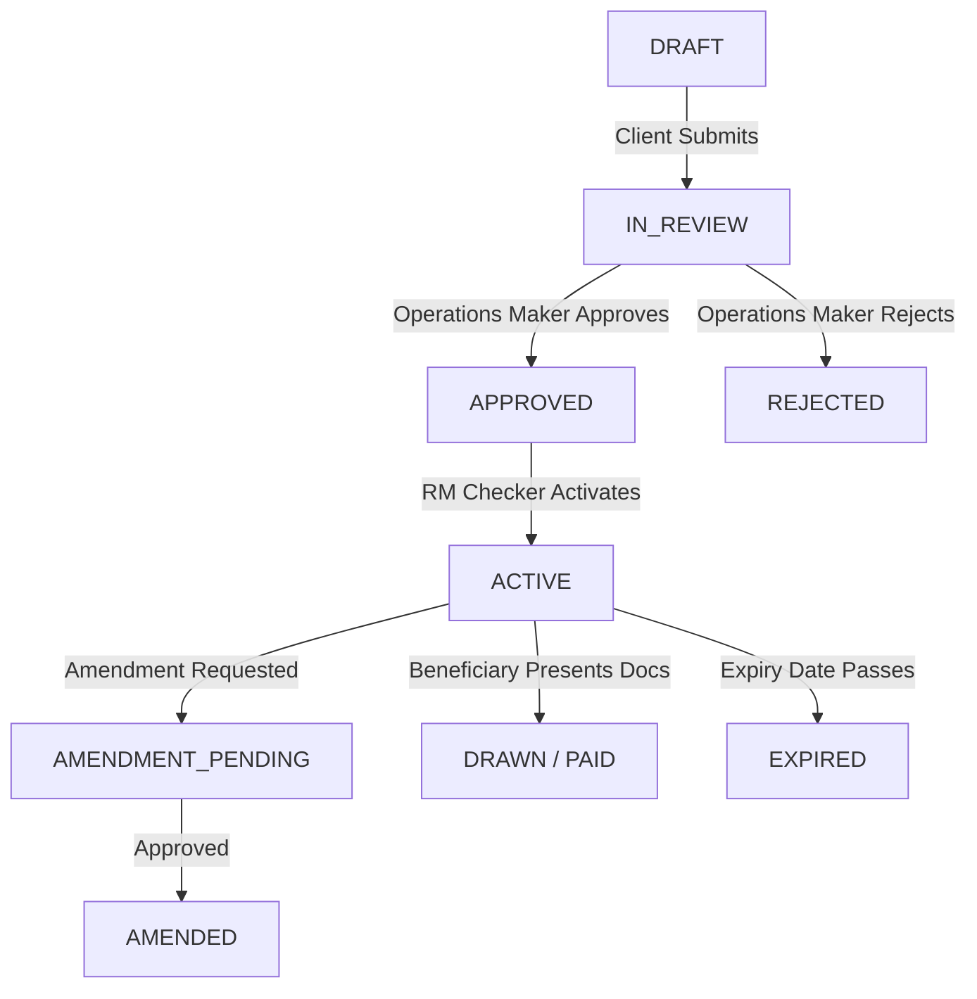
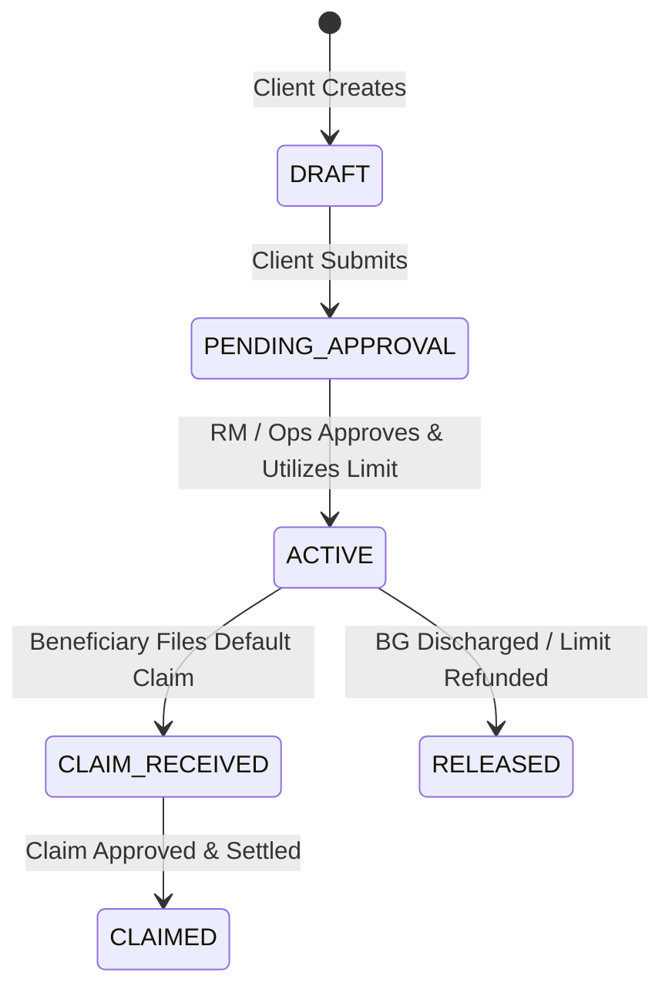
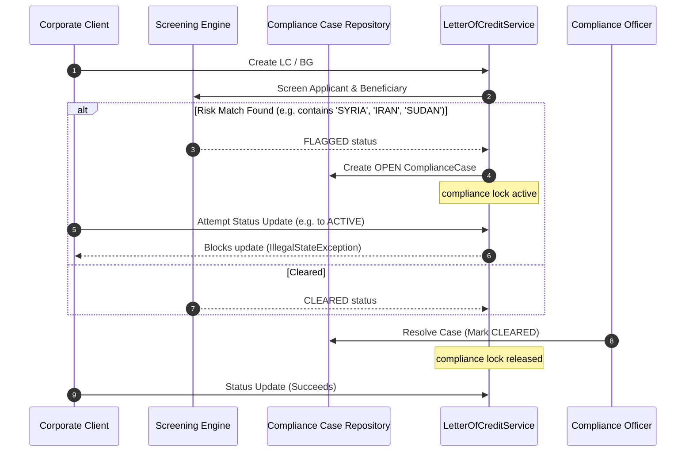
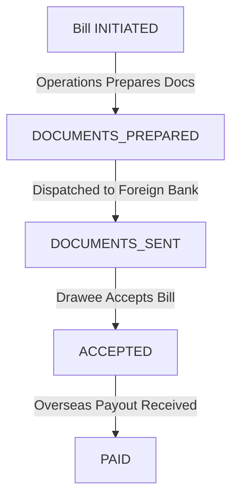
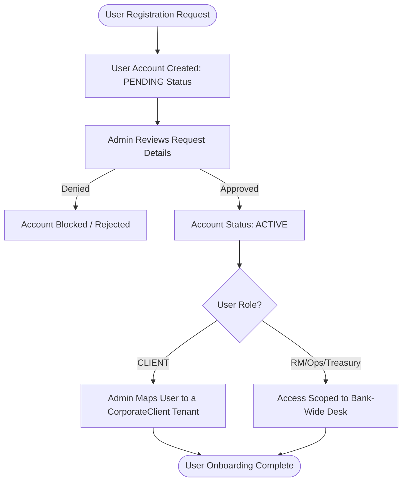
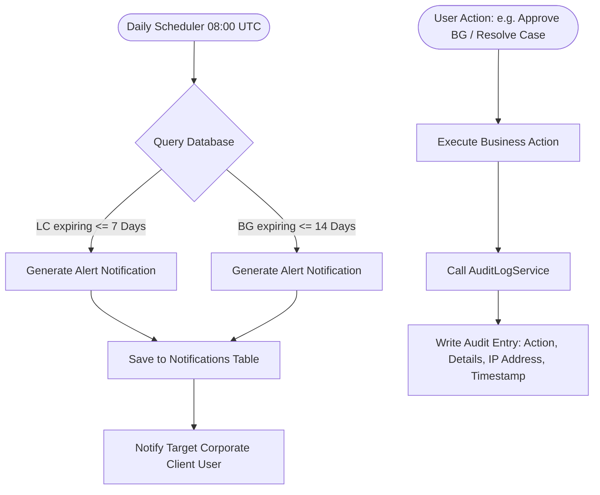

# 🛡️ TradeVault Platform Overview & Module Workflows

TradeVault is a secure, enterprise-grade, multi-tenant Corporate Banking & Trade Finance platform. It is designed to manage complex trade finance pipelines, automate risk screening, and enforce strict role-based transaction audits.

---

## 📋 1. Project Definition

**TradeVault** is a full-stack platform that acts as the digital infrastructure for corporate trade finance. It facilitates the creation, screening, tracking, amendment, and settlement of standard trade finance instruments:
*   **Letters of Credit (LC)**: Guarantees issued by a buyer's bank to ensure payment to a seller once compliance conditions are met.
*   **Bank Guarantees (BG)**: Guarantees that a bank will cover a corporate client's liabilities if they default on a contract.
*   **Export Bills & Collections**: Trade instruments for dispatching and securing payment for exported goods.

---

## 🎯 2. Why and Where TradeVault is Used

### Why it is Used
International trade involves substantial counterparty and financial risks (e.g., currency changes, shipping delays, default risk, and regulatory non-compliance). TradeVault solves these challenges by providing:
1.  **Risk Mitigation**: Secures transactions using bank-backed financial guarantees.
2.  **Maker-Checker Compliance**: Enforces dual-authorization workflows to prevent rogue or incorrect transactions.
3.  **Automated Watchlist Auditing**: Screens entities against global sanctions watchlists (e.g., OFAC, UN) in real-time, preventing financial crimes.
4.  **Credit Limit Controls**: Tracks bank-wide and client-specific credit facilities to prevent credit limit breaches.
5.  **Audit Logs**: Provides a persistent audit log of all critical operations for internal and regulatory reporting.

### Where it is Used
TradeVault is deployed in commercial banks and corporate trade offices. The target users and their workspaces include:
*   **Corporate Clients**: Access the portal to apply for Letters of Credit, submit Bank Guarantees, file claims, and inspect their credit facility utilization.
*   **Trade Operations (Makers)**: Validate submitted documents, flags discrepancies, and verify amendments.
*   **Relationship Managers (Checkers)**: Manage client relationships, audit collateral, approve credit lines, and activate checked trade instruments.
*   **Compliance Officers**: Review flagged sanctions screens and resolve compliance cases.
*   **Treasury Managers**: Access high-level exposure charts and track liquidity requirements.
*   **System Administrators**: Manage user accounts and map users to corporate tenants.

---

## ⚙️ 3. Core Module Workflows & Lifecycles

### 3.1 Letter of Credit (LC) Lifecycle
The LC module utilizes a strict **Maker-Checker** pattern to verify financial limits:

1.  **Draft Creation**: The Corporate Client drafts an LC. At this stage, no credit is utilized.
2.  **Maker Check**: A Trade Operations officer reviews the parameters. If valid, they mark it as `APPROVED`.
3.  **Checker Check**: A Relationship Manager verifies the client's collateral. When marked `ACTIVE`, the utilized credit amount is deducted from the credit facility.
4.  **Presentation & Drawing**: The beneficiary presents documents (e.g., Bill of Lading, Invoice). If documents are missing, the system automatically marks the drawing as `DISCREPANT`. Once validated, the funds are paid and facility limits are updated.

---

### 3.2 Bank Guarantee (BG) & Claims Flow
The BG module supports Bid Bonds, Performance Bonds, and payment guarantees:

1.  **Issuance**: Client initiates a guarantee. Once approved, the utilized limit is blocked.
2.  **Claim Filing**: If the client defaults, the beneficiary files a `BGClaim` against the active guarantee.
3.  **Claim Settlement**: The bank reviews the claim. If approved, the guarantee status is set to `CLAIMED` and the utilized limit is refunded.

---

### 3.3 Sanctions Screening & Compliance Holds
To satisfy regulatory requirements, TradeVault embeds an automated real-time compliance screening watchdog:

*   **Trigger**: Any instrument creation automatically screens applicants and beneficiaries against watchlist patterns.
*   **Holds**: A `FLAGGED` status creates an open `ComplianceCase` and locks the instrument. No state changes are permitted.
*   **Resolution**: A Compliance Officer must explicitly review the case and resolve it to unlock the instrument.

---

### 3.4 Export Bills & Collections Flow
This module oversees the dispatch of trade shipping documents and collects payments from foreign buyers (drawees):

*   **Workflow Steps**:
    1.  **Initiation**: Corporate Client registers an Export Bill detailing invoice amounts, carrier tracking, and foreign drawee names.
    2.  **Compliance Screening**: The drawee's name is automatically screened for sanctions.
    3.  **Collection Instruction**: A companion collection instruction is generated to direct the correspondent bank to release shipping documents only against payment (D/P) or acceptance (D/A).
    4.  **Tracking & Settlement**: As the foreign buyer pays or accepts, status transitions from `DOCUMENTS_SENT` to `ACCEPTED`, and finally to `PAID`.

---

### 3.5 Identity & User Governance Onboarding Flow
To ensure data security, new registrations are subject to a strict admin verification loop:

*   **Multitenancy Boundary**: A client user cannot view or edit any transaction unless they are successfully mapped to a `CorporateClient` record. All SQL queries are implicitly filtered by `corporate_client_id` for security.

---

### 3.6 Expiry Alerts & Audit Pipeline Flow
The platform automates instrument lifecycle warnings and maintains a tamper-evident audit history:

*   **Tamper Evidence**: All critical operations invoke the `AuditLogService`. Logs are persisted with a timestamp and IP address to guarantee a reliable audit trail for compliance desks.
