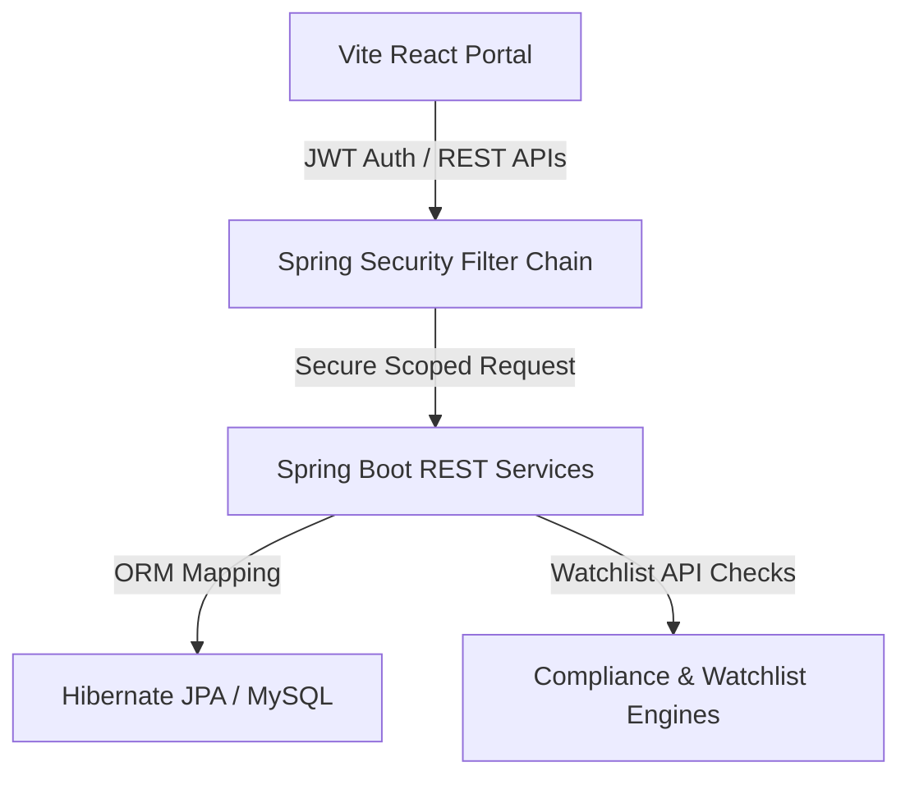
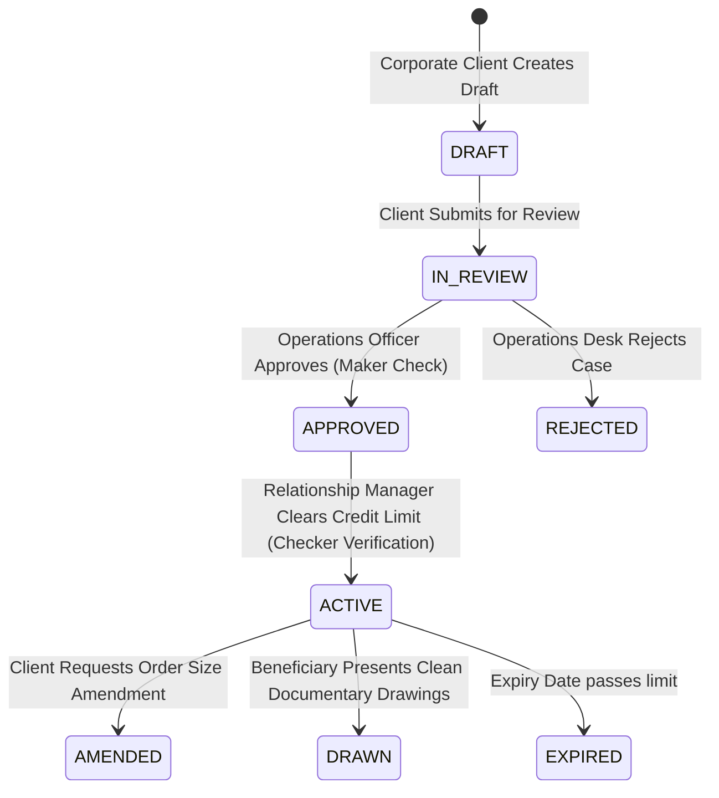

# 🛡️ TradeVault – Full-Stack Enterprise Banking & Trade Finance Platform

TradeVault is a modern, enterprise-grade Corporate Banking & Trade Finance platform built using a robust, multi-tier architecture. It enables commercial banks, corporate clients, relationship managers, compliance desks, and treasury divisions to manage and audit complex trade finance pipelines with high security, precision, and efficiency.

---

## 🏗️ Platform Architecture & Workflows

TradeVault utilizes a modern, dual-tier tech stack combined with strict Role-Based Access Control (RBAC) and automated data-scoping. For a detailed code-level breakdown of the backend, request lifecycles, and core business modules, refer to the [Backend Architecture Guide](file:///d:/TRADE-VAULT/backend/ARCHITECTURE.md).




### 🔒 Access Control Matrix & Roles
TradeVault supports six distinct enterprise roles, each with strict multitenant data isolation boundaries at both API and Database layers:

| Role | Scope / Multitenancy Boundary | Key Responsibilities |
| :--- | :--- | :--- |
| **Corporate Client** | Scoped to own `corporateClientId` | Apply for LCs/BGs, present drawings, request amendments, initiate bills. |
| **Trade Operations** | Bank-Wide (Trade Desk) | Maker workflow: audit presented documents, verify amendments, handle discrepancies. |
| **Relationship Manager** | Bank-Wide (Client Desk) | Checker workflow: verify collateral, approve credit lines, activate checked instruments. |
| **Treasury Manager** | Bank-Wide (Treasury Desk) | Audit bank-wide exposure trends, monitor cash flows, inspect liquidity indices. |
| **Compliance Officer** | Bank-Wide (Compliance Desk) | Track sanctions matches (OFAC/UN watchlists), resolve investigation cases. |
| **System Admin** | Global Platform | Manage identity lifecycle, reactivate/suspend users, map users to client tenants. |

---

## ⚡ Core Trade Workflows & Maker-Checker

The Letter of Credit (LC) and Bank Guarantee (BG) issuance process implements a strict enterprise-grade **Maker-Checker** pattern to verify financial limits and compliance:



---

## 🚀 Key Modules & Features

1. **Identity & Access Governance**:
   * Automatic **`PENDING`** state for new registrations. Administrators must explicitly admit accounts and map them to their respective corporate client organization.
   * Toggle suspension (`ACTIVE` / `SUSPENDED`) instantly terminating login privileges.
2. **Letters of Credit (LC) Core**:
   * Sight & Usance LC wizard forms.
   * Structured history of amendments (previous amount vs. requested amount, justifications).
   * Presentation of Drawings panel with **Automated Discrepancy Screening** (cross-checking Port of Loading and Invoice Limits).
3. **Bank Guarantees (BG) Core**:
   * Bid Bonds, Performance Bonds, and payment guarantees with custom covenants.
   * Partial default breach claim submissions and payment status tracking.
4. **Export Bills & Collections**:
   * Register and dispatch export bills and collection instructions (Sight D/P vs. Usance D/A).
5. **Sanctions screening watchdog**:
   * Real-time automated watchlist matching (OFAC SDN, EU Lists, UN Watchlists).
   * Flagged alerts generate compliance cases for officer investigation.
6. **Executive Analytics Dashboard**:
   * Responsive graphs (exposure trends, instrument distribution charts) using **Recharts**.
   * One-click CSV and print document exporter.

---

## 🛠️ Technology Stack

* **Frontend**: React.js 18 (Vite), Tailwind CSS, Framer Motion, Recharts, Axios, React Router 7, React Hook Form, Lucide Icons.
* **Backend**: Java 17, Spring Boot 3.3, Spring Security, Spring Data JPA, Hibernate, MySQL, Swagger/OpenAPI.
* **Database**: MySQL 8.0+.

---

## ⚙️ Quick Installation & Start Guide

Follow these steps to boot the entire platform locally.

### 1. Database Setup
Ensure MySQL is running on port `3306` and execute the schema initialization:
```bash
# Connect to your MySQL server and run
mysql -u root -p -e "CREATE DATABASE IF NOT EXISTS tradevault;"
```
*Note: On boot, Hibernate `ddl-auto=update` creates the database tables automatically, and the custom Spring Boot seeder class populates the default database states and client mappings.*

### 2. Launch Backend Application
```bash
cd backend
# Compile and start the Spring Boot application
mvn clean spring-boot:run
```
Once initialized, the server starts on [http://localhost:8080/api](http://localhost:8080/api).
* **Swagger/OpenAPI UI**: [http://localhost:8080/api/swagger-ui/index.html](http://localhost:8080/api/swagger-ui/index.html)

### 3. Launch Frontend Client Portal
```bash
cd frontend
# Install dependencies
npm install

# Run Vite local dev server
npm run dev
```
Once compiled, open your browser and navigate to [http://localhost:5173/](http://localhost:5173/).

---

## 🔑 Sandbox Credentials (Password: `password`)

You can use the **Autofill Drawer buttons** on the Login screen to log in immediately under any of the following profiles:

| Role | Username | Test Scope |
| :--- | :--- | :--- |
| **System Admin** | `admin` | Identity & Access Governance, User control |
| **Corporate Client** | `client` | Letter of Credit & BG workspaces (Tenant: Acme Industrial) |
| **Trade Operations** | `ops` | Maker queue: approve LCs, process amendments & drawings |
| **Relationship Manager** | `relationship` | Checker queue: verify facilities limits, activate LCs |
| **Compliance Officer** | `compliance` | Screening dashboard, clear sanctions flags |
| **Treasury Director** | `treasury` | General visualizer, exposure logs, bank liquidity stats |
