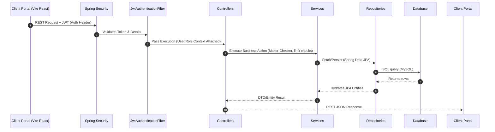

# 🛡️ TradeVault Backend Architecture Guide

TradeVault is built using **Java 21** and **Spring Boot 3.3**, utilizing a layered MVC architecture. This guide provides a top-to-bottom explanation of the backend modules, how requests flow, the core data models (JPA Entities), and their business rules.

---

## 🏗️ 1. Top-to-Bottom Flow of a Request

Every HTTP request sent from the frontend client traverses three main architectural layers before returning a response:

### 1.1 Security Entry & Configuration
*   **Security Configuration ([SecurityConfig.java](file:///d:/TRADE-VAULT/backend/src/main/java/com/tradevault/config/SecurityConfig.java))**:
    *   Defines HTTP endpoint permissions.
    *   Integrates CORS, state-less session management, and registers the JWT filter.
    *   Enforces Role-Based Access Control (RBAC).
*   **Authentication Filter ([JwtAuthenticationFilter.java](file:///d:/TRADE-VAULT/backend/src/main/java/com/tradevault/config/JwtAuthenticationFilter.java))**:
    *   Intercepts every API call.
    *   Extracts the JWT token from the `Authorization: Bearer <token>` header, decodes it using the secret key via [JwtTokenProvider.java](file:///d:/TRADE-VAULT/backend/src/main/java/com/tradevault/config/JwtTokenProvider.java), and sets the authentication status in Spring Security's context.
*   **Auth Controller ([AuthController.java](file:///d:/TRADE-VAULT/backend/src/main/java/com/tradevault/controller/AuthController.java))**:
    *   Handles `/api/auth/login` and `/api/auth/register`.
    *   Requires administrative approval for newly registered users. New corporate accounts start in a `PENDING` state and must be verified and mapped to a [CorporateClient](file:///d:/TRADE-VAULT/backend/src/main/java/com/tradevault/entity/CorporateClient.java) tenant by a `SYSTEM_ADMIN`.
*   **Database Seeding ([DatabaseSeedInitializer.java](file:///d:/TRADE-VAULT/backend/src/main/java/com/tradevault/config/DatabaseSeedInitializer.java))**:
    *   Runs on application boot, pre-populating mock users, corporate organizations, sample credit facilities, and seed trade instruments to enable immediate testing.

---

## 📦 2. Modular Breakdown

The backend contains six distinct business logic modules and one infrastructure module.

---

### 🏛️ Module A: Identity & Tenant Governance
This module handles authentication, onboarding of new corporations, user assignment, and credit limits.

*   **Key Components**:
    *   `AuthController.java` & `UserController.java`
    *   [CorporateController.java](file:///d:/TRADE-VAULT/backend/src/main/java/com/tradevault/controller/CorporateController.java)
    *   [User.java](file:///d:/TRADE-VAULT/backend/src/main/java/com/tradevault/entity/User.java) & [CorporateClient.java](file:///d:/TRADE-VAULT/backend/src/main/java/com/tradevault/entity/CorporateClient.java)
    *   [CreditFacility.java](file:///d:/TRADE-VAULT/backend/src/main/java/com/tradevault/entity/CreditFacility.java)
*   **How it Works**:
    1.  **Multitenancy**: Users mapped to `ROLE_CLIENT` must be associated with a specific `CorporateClient` record. All actions they perform (viewing LCs, issuing BGs, checking exposure) are scoped strictly to their corporate tenant ID.
    2.  **Credit Facilities**: A corporation must have a `CreditFacility` set up by the bank. When trade instruments (like LCs and BGs) are activated, the utilizing amount is deducted from the facility's `limitAmount`. If the required amount exceeds the facility's available limit, the backend blocks the operation with a `BadRequestException`.

---

### 📄 Module B: Letters of Credit (LC) Core
The LC module manages the lifecycle, amendment histories, and drawing presentations of documentary credits.

*   **Key Components**:
    *   `LetterOfCreditController.java`
    *   [LetterOfCreditService.java](file:///d:/TRADE-VAULT/backend/src/main/java/com/tradevault/service/LetterOfCreditService.java)
    *   [LetterOfCredit.java](file:///d:/TRADE-VAULT/backend/src/main/java/com/tradevault/entity/LetterOfCredit.java)
    *   [LCAmendment.java](file:///d:/TRADE-VAULT/backend/src/main/java/com/tradevault/entity/LCAmendment.java)
    *   [LCDrawing.java](file:///d:/TRADE-VAULT/backend/src/main/java/com/tradevault/entity/LCDrawing.java)
*   **Workflow Dynamics**:
    1.  **Draft to Review**: A corporate client creates a letter of credit. It enters a `DRAFT` status and is then submitted for review (`IN_REVIEW`).
    2.  **Maker-Checker Approval**: 
        *   **Maker** (Trade Operations): Inspects documents, validates parameters, and sets the status to `APPROVED`.
        *   **Checker** (Relationship Manager): Double-checks the collateral, ensures compliance, and marks the LC as `ACTIVE`. At this stage, the backend officially updates the credit facility's `utilizedAmount`.
    3.  **Amendments**: If a client needs to alter the amount or expiry date, an `LCAmendment` record is created as `PENDING_APPROVAL`. Once approved, the limit delta is recalculated. If the amount is increased, the facility check runs again. If it passes, the LC's main amount is updated, and it transitions to `AMENDED`.
    4.  **Drawings Presentation**: When the beneficiary presents documents for payout:
        *   A drawing request is created.
        *   **Automated Discrepancy Check**: The service checks if the submitted list of documents contains both `"INVOICE"` and `"BILL OF LADING"`. If either is missing, the drawing is automatically categorized as `DISCREPANT` with descriptive remarks, forcing manual operational intervention.

---

### 🛡️ Module C: Bank Guarantees (BG) Core
This module oversees the lifecycle of Bid Bonds, Performance Bonds, and payment guarantees, along with default claims.

*   **Key Components**:
    *   [BankGuaranteeController.java](file:///d:/TRADE-VAULT/backend/src/main/java/com/tradevault/controller/BankGuaranteeController.java)
    *   [BankGuaranteeService.java](file:///d:/TRADE-VAULT/backend/src/main/java/com/tradevault/service/BankGuaranteeService.java)
    *   [BankGuarantee.java](file:///d:/TRADE-VAULT/backend/src/main/java/com/tradevault/entity/BankGuarantee.java)
    *   [BGClaim.java](file:///d:/TRADE-VAULT/backend/src/main/java/com/tradevault/entity/BGClaim.java)
*   **Workflow Dynamics**:
    1.  **Issuance**: Similar to LCs, BGs are drafted, reviewed, approved, and activated. Limit allocation blocks the respective credit line.
    2.  **BG Claims**: If a beneficiary declares that the applicant defaulted, they can present a claim (`BGClaim`). Claims start in `PENDING_REVIEW` and can transition to `PAID` or `REJECTED` by a Trade Operations officer.

---

### 🚢 Module D: Export Bills & Collections
Manages post-shipment financing and collection tracking under bank rules (Sight D/P vs. Usance D/A).

*   **Key Components**:
    *   [ExportBillController.java](file:///d:/TRADE-VAULT/backend/src/main/java/com/tradevault/controller/ExportBillController.java)
    *   [ExportBillService.java](file:///d:/TRADE-VAULT/backend/src/main/java/com/tradevault/service/ExportBillService.java)
    *   [ExportBill.java](file:///d:/TRADE-VAULT/backend/src/main/java/com/tradevault/entity/ExportBill.java)
    *   [CollectionInstruction.java](file:///d:/TRADE-VAULT/backend/src/main/java/com/tradevault/entity/CollectionInstruction.java)
*   **Workflow Dynamics**:
    1.  **Bill Creation**: Records export invoices, loading ports, and beneficiary dispatch references.
    2.  **Documents Dispatch**: Tracks shipping documents sent to the overseas bank (`DOCUMENTS_SENT`).
    3.  **Collection Status**: Tracks whether documents are released against payment (`PAID` or `ACCEPTED`).

---

### 🔍 Module E: Sanctions Screening Watchdog & Compliance Holds
This module provides automated compliance screening during transaction lifecycles.

*   **Key Components**:
    *   [ComplianceController.java](file:///d:/TRADE-VAULT/backend/src/main/java/com/tradevault/controller/ComplianceController.java)
    *   [SanctionsScreeningService.java](file:///d:/TRADE-VAULT/backend/src/main/java/com/tradevault/service/SanctionsScreeningService.java)
    *   [SanctionsScreening.java](file:///d:/TRADE-VAULT/backend/src/main/java/com/tradevault/entity/SanctionsScreening.java)
    *   [ComplianceCase.java](file:///d:/TRADE-VAULT/backend/src/main/java/com/tradevault/entity/ComplianceCase.java)
*   **The Screening Loop**:
    1.  **Trigger**: Every time an LC is created, the system triggers screening for both the `Applicant` and the `Beneficiary`.
    2.  **String Analysis**: The screening engine inspects the strings for risk indicators (e.g., checking for restricted jurisdictions like `"SYRIA"`, `"SUDAN"`, or `"IRAN"`).
    3.  **Flagging**: If a restricted match is triggered, the system:
        *   Flags the screening record as `FLAGGED` (with a high-risk match score).
        *   Auto-creates an open [ComplianceCase](file:///d:/TRADE-VAULT/backend/src/main/java/com/tradevault/entity/ComplianceCase.java) assigned to the `"compliance"` group.
    4.  **Compliance Hold Lock**: If there is an unresolved `FLAGGED` screening record linked to an LC's reference ID, the `LetterOfCreditService` blocks all status updates with an `IllegalStateException`.
    5.  **Resolution**: A Compliance Officer must explicitly review the case and resolve it as `CLEARED` (releasing the transaction lock) or `RESOLVED_BLOCKED` (keeping the instrument frozen).

---

### 📊 Module F: Trade Analytics & Structured Reports
Enables management to see exposure trends, facility utilization ratios, and export transaction data.

*   **Key Components**:
    *   [TradeAnalyticsController.java](file:///d:/TRADE-VAULT/backend/src/main/java/com/tradevault/controller/TradeAnalyticsController.java) & [TradeReportController.java](file:///d:/TRADE-VAULT/backend/src/main/java/com/tradevault/controller/TradeReportController.java)
    *   [TradeAnalyticsService.java](file:///d:/TRADE-VAULT/backend/src/main/java/com/tradevault/service/TradeAnalyticsService.java) & [TradeReportService.java](file:///d:/TRADE-VAULT/backend/src/main/java/com/tradevault/service/TradeReportService.java)
    *   [TradeReport.java](file:///d:/TRADE-VAULT/backend/src/main/java/com/tradevault/entity/TradeReport.java)
*   **Metrics Engine**:
    *   Aggregates totals across active letters of credit, guarantees, and bills.
    *   Maintains historical `TradeReport` records generated for compliance or audit tracking (scoped by dates or client).

---

### 🔔 Module G: System Infrastructure & Background Jobs
Underpins user experience through system logs, scheduler scripts, and alerts.

*   **Key Components**:
    *   [ExpiryAlertScheduler.java](file:///d:/TRADE-VAULT/backend/src/main/java/com/tradevault/service/ExpiryAlertScheduler.java)
    *   [NotificationService.java](file:///d:/TRADE-VAULT/backend/src/main/java/com/tradevault/service/NotificationService.java)
    *   [AuditLogService.java](file:///d:/TRADE-VAULT/backend/src/main/java/com/tradevault/service/AuditLogService.java)
*   **Background Jobs**:
    *   **Expiry Scanner**: A background CRON job runs daily at `08:00 UTC`. It queries the database for:
        *   **Active/Amended LCs** expiring within **7 days**.
        *   **Active BGs** expiring within **14 days**.
    *   **Alert Generation**: When approaching expiry, the system writes new [Notification](file:///d:/TRADE-VAULT/backend/src/main/java/com/tradevault/entity/Notification.java) records to alert clients and operation desks.
    *   **Auditing**: Critical lifecycle modifications (issuances, approvals, compliance holds, limit updates) invoke `AuditLogService` to log user, IP, action, timestamp, and details into the persistent audit history.

---

## 🛠️ Summary of Technologies & Libraries Used

| Technology | Purpose |
| :--- | :--- |
| **Java 21** | High-performance backend runtime utilizing modern language features. |
| **Spring Boot 3.3** | Web Framework providing dependency injection, MVC structure, and scheduling. |
| **Spring Security** | Secures API endpoints via JWT-based RBAC token inspection. |
| **Spring Data JPA & Hibernate** | Object-Relational Mapping (ORM) to handle MySQL schema mappings. |
| **Lombok 1.18.46** | Eliminates boilerplate fields, getters, setters, and constructors during compilation. |
| **H2 / MySQL** | Dual-compatibility data engine supporting runtime operations and mock tests. |
